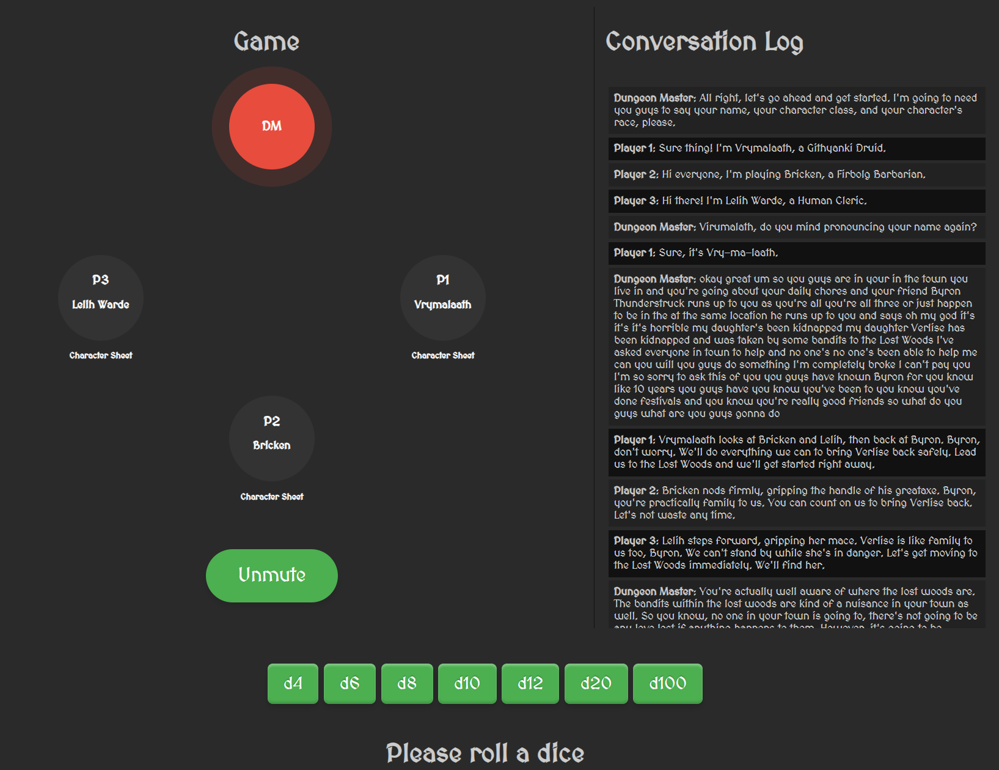

# AI DND Game Simulator



An innovative Flask-based application that allows Dungeon Masters to test their D&D campaigns by simulating player interactions using advanced AI.

## 🎲 Features

- **AI Player Simulation**: Test your campaigns with AI-powered players that respond realistically to your scenarios.
- **Dynamic Conversation System**: Engage in natural language dialogue with simulated players.
- **Character Sheet Integration**: View and manage character sheets for all simulated players.
- **Dice Rolling Simulator**: Integrated dice rolling for all standard D&D dice (d4, d6, d8, d10, d12, d20, d100).
- **Conversation Log**: Keep track of all interactions and rolls in a detailed log.
- **Voice Integration**: Toggle microphone for voice input (experimental feature).

## 🚀 Getting Started

### Prerequisites

- Python 3.8+
- Flask
- Other dependencies (list them here)
- Microphone

### Installation

1. Clone the repository:

```bash
git clone https://github.com/yourusername/ai-dm-simulator.git
```

2. Navigate to the project directory:

```bash
cd ai-dm-simulator
```

3. Install required packages:

```bash
pip install -r requirements.txt
```

4. Run the Flask application:

```bash
flask --app api run
```

5. Open your browser and go to `http://localhost:5000`

## 🖥️ Usage

1. Once you've started the application, click `Unmute` to speak to all players, or click the individual's player name/seat to speak to just that player. YMMV!

## 🤝 Contributing

Contributions, issues, and feature requests are welcome! Feel free to check [issues page](https://github.com/yourusername/ai-dm-simulator/issues).

## 📜 License

This project is [MIT](https://choosealicense.com/licenses/mit/) licensed.

## 👏 Acknowledgements

- OpenAI for the GPT model used in player simulation
- Flask team for the awesome web framework
- D&D community for inspiration and support

---

Made with ❤️ by [New Carrot Games](https://github.com/newcarrotgames)